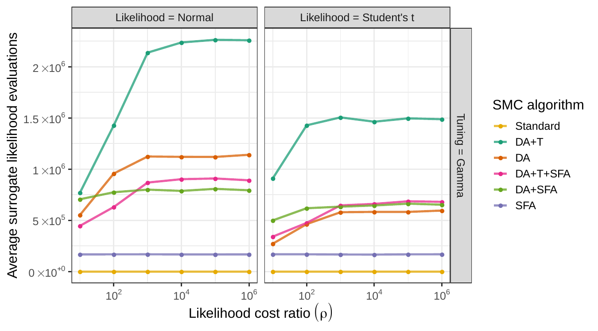

class: list-space

<style>

.list-space li {
padding: 0.25cm;
}

.list-nobullet li {
  list-style-type:none;
}

</style>


```{r setup, load_refs, include=FALSE, cache=FALSE}
library(ggplot2)
library(dplyr)
library(tidyr)
library(scales)
library(RColorBrewer)
library(kableExtra)
library(purrr)

library(RefManageR)
BibOptions(check.entries = FALSE,
           bib.style = "authoryear",
           cite.style = "authoryear",
           style = "html",
           hyperlink = FALSE,
           dashed = FALSE)
myBib <- ReadBib("biblio.bib", check = FALSE)

#### Helpers ####
capitalize <- function(string) {
  substr(string, 1, 1) <- toupper(substr(string, 1, 1))
  string
}

attach_name <- function(string, name){
  paste(name, "=", capitalize(string))
}

label_alg <- Vectorize(function(x){
  
  switch(x,
         smc_standard = "Standard",
         smc_da =  "DA+T",
         smc_da_no_trans = "DA",
         smc_sfa_da = "DA+T+SFA",
         smc_sfa_da_no_trans = "DA+SFA",
         smc_sfa = "SFA",
         smc_approx = "Approx"
         )
  
})

cr_label <- trans_format('log10', math_format(10^.x))

parse_labels <- function(values) {
  #values <- paste0("list(", values, ")")
  values <- gsub("`","", values)
  lapply(values, function(expr) c(parse(text = expr)))
}

flabeller <- labeller(likelihood = function(s) capitalize(s),
                      bss_model = function(s) attach_name(s, "Tuning"),
                      alg = function(s) label_alg(s),
                      cost_ratio = label_parsed,
                      iter_group = label_parsed,
                      beta = label_parsed
                      )

scientific_10 <- function(x, remove_1_times = F) {
  exp_text <- ifelse(x > 1,
         gsub("e\\+", " %*% 10^", scales::scientific_format()(x)),
         gsub("e", " %*% 10^", scales::scientific_format()(x))
  )
  
  if(remove_1_times){
    
    exp_text <- gsub("1 %*% ", "", exp_text, fixed = T)
    
  }

  parse(text = exp_text)
  
}

algs_list_sort <- c("smc_standard", 
                    "smc_da", "smc_da_no_trans", 
                    "smc_sfa_da", "smc_sfa_da_no_trans", 
                    "smc_sfa", "smc_approx")

algs_list_names <- c("Standard", 
                     "DA+T", "DA", 
                     "DA+T+SFA", "DA+SFA", 
                     "SFA", "Approx")

facet_label_scientific_rho <- function(x, rv = T){
  
  levels <- unique(x)
  labels <- ifelse(levels > 1,
                   gsub("e\\+", " %*% 10^", scales::scientific_format()(levels)),
                   gsub("e", " %*% 10^", scales::scientific_format()(levels))
  )
  
  labels <- paste("rho ==", gsub("1 %*% ", "", labels, fixed = T))
  
  if(rv){
    ordered(x, levels = rev(levels), labels = rev(labels))
  } else {
    ordered(x, levels = levels, labels = labels)
  }
}

facet_label_gamma <-  function(x){
  
  levels <- c("(0,3]", "(3,6]", "(6,9]", "(9,Inf]")
  new_labs <- c("group('{',list(1,2,3),'}')", 
                "group('{',list(4,5,6),'}')", 
                "group('{',list(7,8,ldots),'}')",
                "group('{',list(7,8,ldots),'}')")
  
  labels <- paste("gamma ==", new_labs)
  
  ordered(x, 
         levels = levels,
         labels = labels
  )
  
}

knitr::opts_chunk$set(cache = T)

# TODO: result of whittle, andrews comments

```


## Talk outline

1. Overview: Computational Bayesian inference & SMC

2. Tuning delayed-acceptance in SMC

3. Calibrating surrogate likelihoods in SMC

4. Surrogate first annealing strategy

5. Simulation results 

Joint work with **Christopher Drovandi** (QUT) and **Anthony Lee** (Bristol University)

---
class: list-space

# Overview

- Statistical modelling informs decision making under **uncertainty**


- We use data to ensure models are **good approximations** of reality


- Fitting or training models with data uses sophisticated **algorithms**


- Focus is on algorithms for Bayesian models: **Sequential Monte Carlo**


--
<br><br>
**SMC:** `r emo::ji("notes")` **Better. Faster. Stronger.** `r emo::ji("notes")`


---

## Bayesian inference

Bayesian statistical inference uses posterior distributions
$$p(\boldsymbol{\theta}~\vert~\boldsymbol{y}) = \frac{p(\boldsymbol{y}~\vert~\boldsymbol{\theta})p(\boldsymbol{\theta})}{p(\boldsymbol{y})}$$
--

.pull-left[
The posterior is how we reason about:
- uncertain parameters, $\boldsymbol{\theta}$ 
- observed data, $\boldsymbol{y}$
]

--

.pull-right[
Informed by:
- The prior $p(\boldsymbol{\theta})$ for $\boldsymbol{\theta}$
- The likelihood $p(\boldsymbol{y}~\vert~\boldsymbol{\theta})$ for $\boldsymbol{y}$
]

--

.full-width[.content-box-red[
$$p(\boldsymbol{y}) = \int_{\Theta}p(\boldsymbol{y}~\vert~\boldsymbol{\theta})p(\boldsymbol{\theta}) \text{d}\boldsymbol{\theta}$$

- Intractable normalising constant
- High dimensional integrals are difficult to solve analytically! 

]]

---

## Computational Bayesian inference

In practice we only require posterior distribution summaries 
$$\mathbb{E}_{p}[f(\boldsymbol{\theta})] = \int_{\Theta}f(\boldsymbol{\theta})p(\boldsymbol{\theta}~\vert~\boldsymbol{y})\text{d}\boldsymbol{\theta}$$

--

- Exact simulation

    - Direct simulation
    - Rejection sampling
    
--

- Markov chain Monte Carlo (MCMC)

    - Markov chain with invariant distribution equal to posterior

--

- Importance sampling (IS)

    - Construct weighted samples to approximate posterior

--

- Sequential Monte Carlo (SMC)

    - Iterative importance sampling + `r emo::ji("pepper")`

---

## Importance sampling

Importance sampling is based on the identity:

$$\mathbb{E}_{p}[f(\boldsymbol{\theta})]
= \mathbb{E}_{g}\left[f(\boldsymbol{\theta})\frac{p(\boldsymbol{\theta}~\vert~\boldsymbol{y})}{g(\boldsymbol{\theta})}\right]$$

--

For which the Monte Carlo approximation is:

$$\mathbb{E}_{p}[f(\boldsymbol{\theta})] \approx \frac{1}{N}\sum_{i=1}^{N}f(\boldsymbol{\theta}_{i})\frac{ p(\boldsymbol{\theta}_{i}~\vert~\boldsymbol{y})}{g( \boldsymbol{\theta}_{i})}, \quad \boldsymbol{\theta}_{i} \sim g(\boldsymbol{\theta})$$
--

The fundamental elements of importance sampling are
.full-width[.content-box-red[
$$\begin{aligned}\text{Locations: }& \qquad \boldsymbol{\theta}_{i} \sim g(\boldsymbol{\theta})\\
\text{Weights: }& \qquad  w_{i} = \frac{ p(\boldsymbol{\theta}_{i}~\vert~\boldsymbol{y})}{g( \boldsymbol{\theta}_{i})}
\end{aligned}$$
]]

---

## Importance sampling

.content-box-red[
**Importance sampling**: Draw from an approximate distribution, reweight to preserve the correct posterior expectation]

--

Wait! What about the normalising constant?

--

$$w_{i} = \frac{ p(\boldsymbol{\theta}_{i}~\vert~\boldsymbol{y})}{g( \boldsymbol{\theta}_{i})}$$

--

$$w_{i} \propto W_{i} = \frac{ p(\boldsymbol{y}~\vert~\boldsymbol{\theta}_{i})p(\boldsymbol{\theta}_{i}) }{g( \boldsymbol{\theta}_{i})}$$


Self-normalise to avoid computing the constant: $$w_{i} = \frac{W_{i}}{\sum_{i=1}^{N} W_{i}}$$

---

## Sequential Monte Carlo

Hard to develop an importance distribution $g(\boldsymbol{\theta})$! 

 `r emo::ji("pepper")` Take a series of smaller steps.

--

- Choose a schedule to connect a tractable starting distribution $p_{0}(\boldsymbol{\theta})$ to the posterior $p_{T}(\boldsymbol{\theta}) = p(\boldsymbol{\theta}~\vert~\boldsymbol{y})$. For example

$$p_{t}(\boldsymbol{\theta}) = p_{0}(\boldsymbol{\theta})^{1-\gamma_{t}}p(\boldsymbol{\theta}~\vert~\boldsymbol{y})^{\gamma_{t}} \quad t = 1, 2, \ldots, T$$

--

- With temperature schedule:

$$0 = \gamma_{0} < \gamma_{1} < \cdots < \gamma_{T-1} < \gamma_{T} = 1$$

--

- Draw a sample from starting distribution $p_{0}(\boldsymbol{\theta})$.

--

.full-width[.content-box-red[**Problem**: The variance of the weights increases after each iteration]]

---

## Sequential Monte Carlo 

To avoid particle degeneracy, after reweighting:

--

.full-width[.content-box-purple[
`r emo::ji("pepper")` **Resample**: Randomly select particles according to weight. 
- Survival of the fittest.
]]

--

.full-width[.content-box-red[
`r emo::ji("pepper")` **Refresh**: Mutate samples to avoid degeneracy in particles
- Often use MCMC kernels
]]
    
---
class: hide-logo

Example SMC algorithm: Resample-move for static models
```{r smc-alg, echo=FALSE, eval=TRUE, fig.align='center', out.width= 650}
knitr::include_graphics("imgs/smc_algorithm.svg")
```

---
class: inverse, center, middle, hide-logo

# Using surrogate likelihoods in SMC:

## Delayed-acceptance


---
class: list-space
## Background: Delayed-acceptance

One option for the refresh (mutation) step in SMC is a Metropolis-Hastings kernel.

1. Propose new location for particle from proposal distribution
2. Calculate acceptance rate
3. Accept/reject proposal

--

.full-width[.content-box-red[
**Computational cost**: Likelihood (posterior) evaluation at proposal.
]]

---
class: middle, center

What if $p(\boldsymbol{\theta}~\vert~\boldsymbol{y})$ is expensive to calculate?

```{r waiting-judy, echo=FALSE, eval=TRUE, fig.align='center', out.width = 234*2, out.height = 176*2}
knitr::include_graphics("imgs/judy_time_ticking.gif")
```

---

## Background: Delayed-acceptance

.full-width[.content-box-red[
- Delayed-acceptance splits the MH algorithm into parts
- Evaluate proposal using a cheap surrogate likelihood (or posterior)
- Correct for approximation in a second evaluation
]]

--

1. **Propose** new location from $\boldsymbol{\theta}_{t-1}$ using $\boldsymbol{\theta}_{t}^{\prime} \sim q(\boldsymbol{\theta}~\vert~\boldsymbol{\theta}_{t-1})$
    
--

2. Calculate **acceptance probability** (surrogate)* 

$$\alpha^{(1)} = \min\left(1,\frac{\tilde{p}(\boldsymbol{\theta}_{t}^{\prime}~\vert~\boldsymbol{y})}{\tilde{p}(\boldsymbol{\theta}_{t-1}~\vert~\boldsymbol{y})} \right)$$

where $\tilde{p}(\boldsymbol{\theta}_{t}~\vert~\boldsymbol{y})$ is a cheap approximation of $p(\boldsymbol{\theta}_{t}~\vert~\boldsymbol{y})$. 


*MH ratio assumes symmetric proposal $q(\cdot,\cdot)$ for simplicity.

---

## Background: Delayed-acceptance

1. **Propose** new value...

2. Calculate **acceptance probability** (surrogate)...

--

3. **Evaluate** proposal (surrogate)

  (a) Reject: $\boldsymbol{\theta}_{t} \leftarrow \boldsymbol{\theta}_{t-1}$ with probability $1 - \alpha^{(1)}$, and

  (b) Provisionally accept with probability $\alpha^{(1)}$

--

4. If provisionally accepted, calculate **acceptance probability** (full) 
   $$\alpha^{(2)} = \min\left(1,\frac{\tilde{p}(\boldsymbol{\theta}_{t-1}~\vert~\boldsymbol{y})}{\tilde{p}(\boldsymbol{\theta}_{t}^{\prime}~\vert~\boldsymbol{y})} \frac{p(\boldsymbol{\theta}_{t}^{\prime}~\vert~\boldsymbol{y})}{p(\boldsymbol{\theta}_{t-1}~\vert~\boldsymbol{y})}  \right)$$
--

5. **Evaluate** proposal (full) 

  (a) Reject: $\boldsymbol{\theta}_{t} \leftarrow \boldsymbol{\theta}_{t-1}$ with probability $1 - \alpha^{(2)}$, or

  (b) Accept: $\boldsymbol{\theta}_{t} \leftarrow \boldsymbol{\theta}_{t-1}$ with probability $\alpha^{(2)}$


---

## Adaptive delayed-acceptance in SMC

- The proposal distribution $q_{\phi}(\boldsymbol{\theta}^{\prime}~\vert~\boldsymbol{\theta})$ has tuning parameters $\phi$.

--

- DA is most efficient when big steps are taken
  - lots of rejections, but a few big accepted jumps

--

- SMC can use a stopping criterion to determine number of cycles in the mutation step
  - i.e. a diversification criterion

--

.full-width[.content-box-red[
**Idea**: Select kernel tuning parameters by optimising computation time with respect to a diversification criterion
]]

---

## Diversification criteria

After resampling, particles are duplicated. One such criterion uses the median of the expected jumping distances [(Salomone et al, 2018)](https://arxiv.org/abs/1805.03924):

$$D(k,\boldsymbol{\phi}) = \text{median}\left\{\sum_{s=1}^{k} J_{s}(\boldsymbol{\phi}) \right\}$$
- $k$ is number of cycles in the mutation step

- $J_{s}$ is expected squared jumping distance (ESJD, [Pasarica and Gelman, 2010](www.jstor.org/stable/24308995)) (Mahalanobis distance)

- Helps to ensure a sufficient amount of diversification

---

## Optimising computation time

Model for expected computation time of $k$ delayed-acceptance iterations

$$C(k,\boldsymbol{\phi}) = k(L_{S} +  \alpha^{(1)}(\boldsymbol{\phi})L_{F})$$

- $L_{S}$: cost of surrogate likelihood 
- $L_{F}$: cost of full likelihood
- $\alpha^{(1)}(\phi)$: first stage acceptance for $\phi$

--

.full-width[.content-box-red[
**Key idea**: Minimise computational costs subject to sufficient particle diversification
]]

---

## Optimising computation time

Solve the following approximately

$$\arg \min_{\boldsymbol{\phi}} C(k,\boldsymbol{\phi})$$
$$\text{such that } D(k,\boldsymbol{\phi}) > d$$

--

**Procedure**

With fixed, finite tuning parameter test set, e.g. $\phi \in \{0.1, 0.5, 1.0\}$ 

--

1. Run pilot mutation step to estimate:

    - $\hat{L}_{S}$, $\hat{L}_{F}$, $\widehat{\alpha^{(1)}}(\phi)$:
    - Minimum $k_{\phi}$ using an "ESJD model" for $D(k,\boldsymbol{\phi})$ 
--

2. Find $\phi^{\star}$ using estimates from pilot run

--

3. Run mutation steps until diversification criterion threshold is met

---
class: list-space

## Models for ESJD 

The pilot run ESJD are used to determine the minimum number of kernel cycles required.

$$D(k,\boldsymbol{\phi}) = \text{median}\left\{\sum_{s=1}^{k} J_{s}(\boldsymbol{\phi}) \right\}$$

For each $\boldsymbol{\phi} \in \Phi$ find minimum $k$ such that $D(k,\boldsymbol{\phi}) > d$.

--

**Models for total ESJD**

--

- Gamma assumption: $\sum_{s=1}^{k} J_{s}(\boldsymbol{\phi}) \sim \text{Gamma}(k\widehat{a_{\boldsymbol{\phi}}},\widehat{b_{\boldsymbol{\phi}}})$

--

- Median approximation: $k^{*}_{\boldsymbol{\phi}} = \min\left\{k \in \mathbb{Z}_{+}: k \times \text{median}\{J_{1}(\boldsymbol{\phi})\}\geq d \right\}$

---
class: list-space

## Aside: Optimising computation time

Using the same optimisation strategy,

$$\arg \min_{\boldsymbol{\phi}} C(k,\boldsymbol{\phi})$$
$$\text{such that } D(k,\boldsymbol{\phi}) > d,$$

in the context of standard Metropolis-Hastings 

$$
C(k,\boldsymbol{\phi}) = k L_{F}
$$

Particular choices of $D(k,\boldsymbol{\phi})$ result in similar tuning strategies in the SMC literature:

- Targetting $k$ via acceptance rates [(Drovandi et al, 2011)](https://doi.org/10.1016/j.csda.2011.03.019)
- Targetting median ESJD across particles [(Salomone et al, 2018)](https://arxiv.org/abs/1805.03924)

---
class: inverse, center, middle, hide-logo

# Using surrogate likelihoods in SMC:

## Calibrating the surrogate likelihood

---

## Calibrating the surrogate likelihood

.full-width[.content-box-red[
**Key idea**: Use current location or location history of the particles to calibrate the surrogate likelihood (better match the full likelihood).
]]

--

**1. Location-scale transformation**

- Take $T_{\boldsymbol{\xi}}$, a pre-specified transformation with parameters $\boldsymbol{\xi}$

--

- Particle history: $H(L) = \{ (\boldsymbol{\theta}, L(\boldsymbol{y}~\vert~\boldsymbol{\theta})): L(\boldsymbol{y}~\vert~\boldsymbol{\theta}) \text{ has been evaluated at } \boldsymbol{\theta}\}.$

--

- Find $$\boldsymbol{\xi}^{\star} = \min_{\boldsymbol{\xi}} \sum_{\boldsymbol{\theta} \in H(L)}d\left[ L(\boldsymbol{y}~\vert~\boldsymbol{\theta}), \tilde{L}(\boldsymbol{y}~\vert~T_{\boldsymbol{\xi}}(\boldsymbol{\theta}))\right]$$

--

- $d$ is some discrepancy measure, e.g. squared difference of the log-likelihoods

--

- Use a subset of the history, to reduce computational cost

---
## Calibrating the surrogate likelihood

**2. Temperature weighting**

--

For surrogate likelihoods that can be factorised

- e.g. $\tilde{L}(\boldsymbol{y}~\vert~\boldsymbol{\theta}) = \prod_{i=1}^{n} \tilde{p}(y_{i}~\vert~\boldsymbol{\theta})$

--

- Let $\tilde{L}(\boldsymbol{y}~\vert~\boldsymbol{\theta},\boldsymbol{\omega}) = \prod_{i=1}^{n} \tilde{p}(y_{i}~\vert~\boldsymbol{\theta})^{\omega_{i}}$

--

-  Find $$\boldsymbol{\omega}^{\star} = \min_{\boldsymbol{\omega}} \sum_{\boldsymbol{\theta} \in H(L)}d\left[ L(\boldsymbol{y}~\vert~\boldsymbol{\theta}), \tilde{L}(\boldsymbol{y}~\vert~\boldsymbol{\theta}, \boldsymbol{\omega})\right] + \lambda \Vert\boldsymbol{\omega}\Vert_{1}$$

--

- If $d$ is squared difference of the log-likelihoods, this is equivalent to the standard Lasso

---
class: inverse, center, middle, hide-logo

# Using surrogate likelihoods in SMC:

## Surrogate first annealing

---
## Surrogate first annealing

.full-width[.content-box-red[
**Key idea**:
Use two stages of annealing in SMC to eliminate unlikely particles early with low cost.
]]

--

$$p_{0}(\boldsymbol{\theta}) \rightarrow \tilde{p}(\boldsymbol{\theta}~\vert~\boldsymbol{y})^{\lambda} \rightarrow p(\boldsymbol{\theta}~\vert~\boldsymbol{y}), \quad 0 < \lambda \leq 1$$

--

| $\gamma_{t}\qquad$ | $p_{t}(\boldsymbol{\theta})$ |
|--------------------------------------|----------------|
| 0.0 | $p_{0}(\boldsymbol{\theta})$ |
| 0.5 | $p_{0}(\boldsymbol{\theta})^{0.5}\tilde{p}(\boldsymbol{\theta}~\vert~\boldsymbol{y})^{0.5\lambda}$ |
| 1.0 | $\tilde{p}(\boldsymbol{\theta}~\vert~\boldsymbol{y})^{\lambda}$ |
| 1.5 | $\tilde{p}(\boldsymbol{\theta}~\vert~\boldsymbol{y})^{0.5\lambda} p(\boldsymbol{\theta}~\vert~\boldsymbol{y})^{0.5}$ |
|  2.0 | $p(\boldsymbol{\theta}~\vert~\boldsymbol{y})$ |

---
class: list-space
## Recap

Three strategies used:

1. Delayed-acceptance
    - Tuned with particles and computation optimisation
2. Surrogate likelihood calibration
    - Uses history of particles
3. Surrogate first annealing
    - Surrogate posterior is intermediate distribution

---

## Testing the strategies with simulations

Run simulation to test optimisation framework

- Number of particles: 1000 or 2000

- Linear regression with $p = 5$

- Full likelihood: Normal or student-t distribution df = 3 (with artificial delay)

- Surrogate likelihood: Biased normal distribution

- Ratio of full to surrogate cost: $\rho \in \{10^1,10^2,10^3,10^4,10^5,10^6\}$

- Calibration using squared difference of surrogate and full log-likelihood (with regularisation)

--

**Test with combinations of SMC flavours**: 

- DA = delayed-acceptance kernel
- T = Transformation (surrogate calibration)
- SFA = Surrogate first annealing

---
class: list-space

## Results: Overview

- DA+T+SFA had the best *computation* time improvements
   - speeding up the SMC by $1.90\times$ to $6.95\times$ compared to standard SMC. 

--
- DA+T+SFA had the best *efficiency* gains also 
   - MSE $\times$ SLE: gains of $2.20\times$ to $7.71\times$ 
   - MSE $\times$ time: gains of $1.86\times$ to $8.30\times$

--
- Neither DA+T or SFA outperformed the other comprehensively

--
- DA+T+SFA has super-linear performance compared to DA+T or SFA alone

---

## Results: Efficiency

```{r s-smc-eff, echo = F, eval = T, cache = T, out.width = '800px', out.height='500px', fig.width = 16, fig.height=10}

beta_sse <- readRDS("rds/beta_sse.rds")
comp_time <- readRDS("rds/comp_time.rds")
l_evals <- readRDS("rds/l_evals.rds")
pdensity_sample <- readRDS("rds/post_density_sample.rds")

suppressMessages({ eff_l_evals <- full_join(l_evals,beta_sse) }) 

eff_l_evals <- eff_l_evals %>%
  mutate(eff_le = beta_mse * (lhood_true_mean + lhood_approx_mean/cost_ratio) )

eff_l_evals %>% 
  filter(n_particles == 2000, alg != "smc_approx") %>%
  ggplot(aes(y = eff_le, x = cost_ratio, colour = alg)) +
  geom_point(size = 2) +
  geom_line(size = 2, alpha = 0.75) +
  scale_x_log10(labels=trans_format('log10',math_format(10^.x))) +
  scale_y_log10(labels=trans_format('log10',math_format(10^.x)), breaks = 10^c(2,2.5,3,3.5, 4), expand = c(0.1,0.1)) +
  scale_color_manual("SMC algorithm", values = brewer.pal(length(algs_list_names), "Dark2"),
                     breaks = algs_list_sort,
                     labels = algs_list_names, 
                     guide = guide_legend(ncol = 1)) +
  facet_grid(likelihood ~ bss_model, labeller = flabeller, scales = "free_y") +
  xlab(expression("Likelihood cost ratio"~ (rho))) +
  ylab("MSE x SLE") +
  theme_bw(base_size=25) + theme(legend.title = NULL)


```
---
exclude: true

## Results: Surrogate evaluations

```{r plot-surr, echo = FALSE, out.width='90%', }

```

---


## Results: Example posterior comparisons

```{r plot-post, echo = FALSE, out.width = '800px', out.height='500px', fig.width = 16, fig.height=10}


facet_label_beta <- function(b){
  
  levels <- unique(b)
  
  labels <- paste0(gsub("V", "beta[", levels),"]")
  
  ordered(b, 
          levels = levels,
          labels = labels
  )
  
}

pdensity_ind <- pdensity_sample %>% 
  group_by(beta, alg, likelihood, cost_ratio, bss_model, n_particles) %>% 
  mutate(iter = factor(iter, levels = unique(iter), labels = 1:10)) %>% # standardised iter labels
  ungroup() %>%
  filter(iter %in% 1:4) %>% # only take 4 of 10
  mutate(x = map(density_est, ~.x$x),
         y = map(density_est, ~.x$y)
         ) %>%
  select(-density_est) %>% 
  unnest(c(x, y))

it <- 1

pdensity_ind %>% filter(bss_model == "median", n_particles == 2000, iter == it,
                          alg %in% c("smc_approx", "smc_sfa_da", "smc_standard")
                          ) %>% 
    filter(beta %in% c("V1","V2")) %>%
    mutate(beta = facet_label_beta(beta),
           cost_ratio = facet_label_scientific_rho(cost_ratio, rv = F)) %>%
    ggplot() +
    geom_line(aes(x = x, y = y, colour = alg), size = 1.7, alpha = 0.7)  +
    facet_grid(likelihood+beta ~ cost_ratio, scales = "free_y", labeller = flabeller) + 
    scale_color_manual("SMC algorithm", values = brewer.pal(length(algs_list_names), "Dark2"),
                       breaks = algs_list_sort,
                       labels = algs_list_names, 
                       guide = guide_legend(rcow = 2)) + 
    scale_x_continuous("Value") + 
    scale_y_continuous("Posterior density") + 
    theme_bw(base_size = 25) +
    theme(axis.text.y=element_blank(), 
          axis.ticks.y=element_blank(),
          axis.text.x = element_text(angle = 90, hjust = 1),
          legend.position = "bottom")

```

---
class: middle, center

# Thank you! (And questions)

